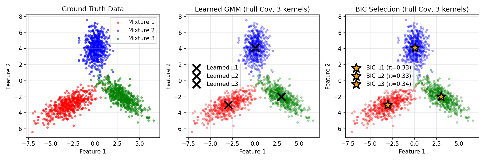
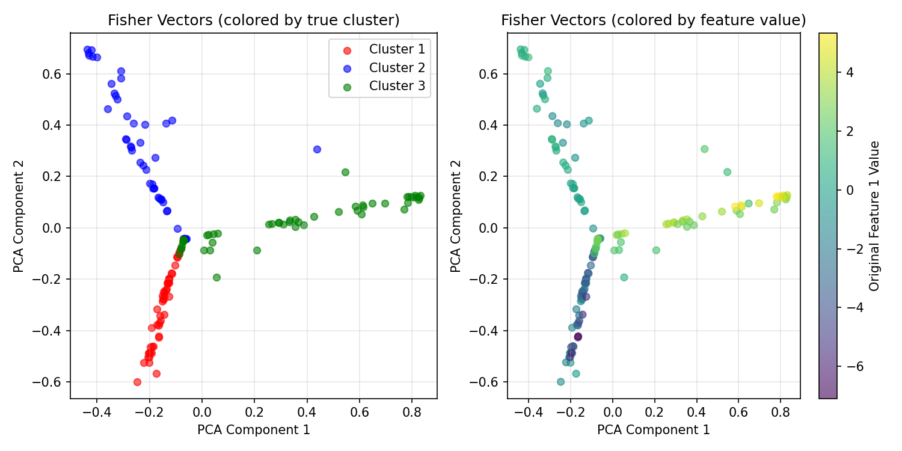

# DeepFV - Fisher Vectors with Deep Learning

A TensorFlow-based implementation of Improved Fisher Vectors as described in [1]. This package provides a modern, scalable approach to computing Fisher Vectors using deep learning techniques. For a concise description of Fisher Vectors see [2].

## Features

- **Full & Diagonal Covariance Support**: Model complex elliptical clusters with full covariance matrices, or use diagonal covariance for faster training
- **Mini-batch Training**: Scalable to large datasets with mini-batch gradient descent
- **Variable-length Bags**: Native support for Multiple Instance Learning with variable instances per bag
- **BIC-based Model Selection**: Automatically determine optimal number of GMM components
- **GPU Acceleration**: Built on TensorFlow 2.x for fast training on GPUs
- **MiniBatchKMeans Initialization**: Smart initialization using scikit-learn's MiniBatchKMeans
- **Memory-efficient Batch Processing**: Handle millions of samples with configurable batch sizes
- **Save/Load Models**: Persist trained models for reuse
- **Normalized Fisher Vectors**: Implements improved Fisher Vector normalization

## Installation

Install from PyPI:
```bash
pip install DeepFV
```

Or install from source:
```bash
git clone https://github.com/sidhomj/DeepFV.git
cd DeepFV
pip install -r requirements.txt
pip install -e .
```

## Quick Start

### 1. Prepare your data
```python
import numpy as np

# Example: SIFT descriptors from images
shape = [300, 20, 32]  # (n_samples, n_descriptors_per_sample, feature_dim)
sample_data = np.concatenate([
    np.random.normal(-np.ones(30), size=shape),
    np.random.normal(np.ones(30), size=shape)
], axis=0)
```

### 2. Train with mini-batch gradient descent
```python
from DeepFV import FisherVectorDL

# Create model with FULL covariance support
fv_dl = FisherVectorDL(
    n_kernels=10,
    feature_dim=32,
    covariance_type='full'  # or 'diag' for diagonal covariance
)

# Fit with mini-batch training
fv_dl.fit_minibatch(
    sample_data,
    epochs=100,
    batch_size=1024*6,
    learning_rate=0.001,
    verbose=True
)
```

### 3. BIC-based model selection
```python
# Automatically select optimal number of components
fv_dl = FisherVectorDL(feature_dim=32, covariance_type='full')
fv_dl.fit_by_bic(
    sample_data,
    choices_n_kernels=[2, 5, 10, 20],
    epochs=80,
    batch_size=1024,
    verbose=True
)

print(f"Selected {fv_dl.n_kernels} components")
```

### 4. Compute Fisher Vectors

For data with multiple descriptors per sample (3D):
```python
# Compute normalized Fisher Vectors
sample_data_test = sample_data[:20]
fisher_vectors = fv_dl.predict_fisher_vector(sample_data_test, normalized=True)

# Output shape: (n_samples, 2*n_kernels, feature_dim)
print(f"Fisher vector shape: {fisher_vectors.shape}")
```

For simple 2D data (each sample is a single feature vector):
```python
# 2D input: (n_samples, feature_dim)
simple_data = np.random.randn(100, 32)
fisher_vectors_2d = fv_dl.predict_fisher_vector(simple_data, normalized=True)

# Output shape: (n_samples, 2*n_kernels, feature_dim)
print(f"Fisher vector shape: {fisher_vectors_2d.shape}")
```

### 5. Variable-length bags (Multiple Instance Learning)

For datasets where each bag contains a variable number of instances:

```python
# Example: 3 images with different numbers of SIFT descriptors
X = np.random.randn(245, 128)  # 245 total descriptors, 128-dim features

# bag_ids maps each instance to its bag
# Image 0 has 50 descriptors, Image 1 has 120, Image 2 has 75
bag_ids = np.array([0]*50 + [1]*120 + [2]*75)

# Train on all instances (ignoring bag structure)
fv_dl = FisherVectorDL(n_kernels=10, feature_dim=128)
fv_dl.fit_minibatch(X, epochs=100, verbose=True)

# Compute Fisher Vectors per bag
fisher_vectors, unique_bag_ids = fv_dl.predict_fisher_vector_bags(
    X,
    bag_ids,
    normalized=True,
    verbose=True
)

print(f"Fisher vectors shape: {fisher_vectors.shape}")  # (3, 20, 128)
print(f"Bag IDs: {unique_bag_ids}")  # [0, 1, 2]
```

**Use cases for bag-level Fisher Vectors:**
- **Image retrieval**: Variable number of SIFT/SURF descriptors per image
- **Document classification**: Variable number of word embeddings per document
- **Multiple Instance Learning (MIL)**: Variable instances per bag in medical imaging, etc.
- **Time series**: Variable-length sequences aggregated into fixed representations

**Memory-efficient processing for large datasets:**
```python
# Process millions of instances efficiently with batching
fisher_vectors, unique_bag_ids = fv_dl.predict_fisher_vector_bags(
    X_large,           # Millions of instances
    bag_ids_large,     # Corresponding bag IDs
    batch_size=1000,   # Process 1000 bags at a time
    verbose=True       # Show progress
)
```

### 6. Save and load models
```python
# Save trained model
fv_dl.save_model('my_model.pkl')

# Load model later
from DeepFV import FisherVectorDL
fv_dl_loaded = FisherVectorDL.load_model('my_model.pkl')
```

## Why FisherVectorDL?

### Advantages over traditional GMM implementations:

1. **Full Covariance Support**: Model rotated/tilted elliptical clusters, not just axis-aligned ones
2. **Scalability**: Mini-batch training handles datasets too large to fit in memory
3. **Speed**: GPU acceleration via TensorFlow for faster training
4. **Flexibility**: Customizable learning rate, batch size, and number of epochs
5. **Modern Stack**: Built on TensorFlow 2.x with eager execution
6. **Smart Initialization**: Uses MiniBatchKMeans for better starting parameters

## Testing

Run the test script to see a 2D visualization:
```bash
python test_fishervector_dl.py
```

This will:
- Generate 3 elliptical Gaussian clusters
- Train a GMM with full covariance
- Use BIC to select optimal number of components
- Compute and visualize Fisher Vectors
- Save visualizations as PNG files

### Example Results

**GMM Clustering with BIC Selection:**



The plot shows how full covariance GMMs can model rotated elliptical clusters. The BIC criterion automatically selects the optimal number of components.

**Fisher Vector Visualization:**



Left: Original 2D data colored by true cluster labels. Right: Fisher Vectors projected back to 2D using PCA, showing how the representation captures cluster structure.

## Contributors

* **John-William Sidhom** (https://github.com/sidhomj/) - Main contributor, TensorFlow implementation with full covariance support

### Original Contributors:
* Jonas Rothfuss (https://github.com/jonasrothfuss/) - Original implementation
* Fabio Ferreira (https://github.com/ferreirafabio/) - Original implementation

## References

- [1] Perronnin, F., Sánchez, J., & Mensink, T. (2010). Improving the fisher kernel for large-scale image classification. In European conference on computer vision (pp. 143-156). Springer, Berlin, Heidelberg. https://www.robots.ox.ac.uk/~vgg/rg/papers/peronnin_etal_ECCV10.pdf
- [2] Fisher Vector Fundamentals - VLFeat Documentation: http://www.vlfeat.org/api/fisher-fundamentals.html

## License

MIT License - see LICENSE file for details
